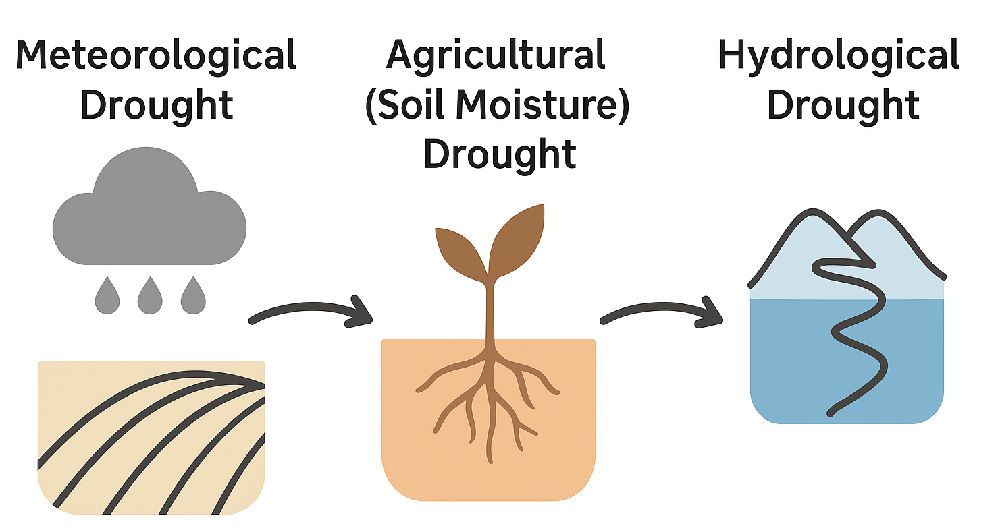

# What is a drought?

Drought is a complex and slowly evolving phenomenon. It varies across regions and affects different parts of the water cycle in distinct ways.
To understand drought properly, we need to look at its main types and the **indices** used to measure and compare drought conditions.
This page provides a concise overview of the three broad categories of drought — meteorological, agricultural, and hydrological — and then highlights two of the most widely used climate‑based drought indicators: the **Standardized Precipitation Index (SPI)** and the **Standardized Precipitation–Evapotranspiration Index (SPEI)**.
For those who want to explore the topic in more depth, we also link to trusted sources, including the **World Meteorological Organization (WMO)**, **the European Drought Observatory (EDO)**, and the **Global Drought Observatory (GDO)**.


---

## Types of drought: meteorological, agricultural, and hydrological

Drought is not a single concept, as drought moves across different parts of the water cycle.  
Understanding the major drought types helps interpret what drought indices can (and cannot) capture.



---

### Meteorological drought

Meteorological drought refers to a period in which precipitation falls significantly below what is considered normal for a specific region (Gibbs & Maher, 1967). It is the earliest form of drought to appear because it develops directly in the atmosphere, typically visible through unusual or persistent rainfall deficits.
This type of drought is commonly measured **using climate‑based indicators** such as **percentiles, the Standardized Precipitation Index (SPI), and the Standardized Precipitation–Evapotranspiration Index (SPEI)**, which help detect and compare anomalies in precipitation patterns.
Meteorological drought usually **unfolds over weeks to months** and marks the first stage in the broader drought cascade, often preceding agricultural and hydrological impacts.

---

### Agricultural drought

Agricultural drought occurs when **soil moisture** levels become too low to meet the needs of vegetation or crops (FAO, 2013). It develops in the root zone and upper soil layers, where plants draw water for growth. Even if rainfall deficits are moderate, rising temperatures or increased evaporative demand can accelerate soil drying, making this type of drought particularly sensitive to warming trends.
To track agricultural drought, several indicators are commonly used. These include **soil moisture anomalies, the Evaporative Stress Index (ESI), and vegetation‑based metrics such as NDVI and other satellite‑derived indices**, which monitor plant stress. Climate‑based indices like SPEI can also signal agricultural drought because they account for temperature‑driven evaporative demand.
Agricultural drought typically **develops over weeks to months** and can have immediate and severe impacts, including crop failures, vegetation stress, and an elevated risk of wildfires.
---

### Hydrological drought

Hydrological drought refers to **long‑term shortages in water** stored or flowing through rivers, groundwater systems, lakes, and reservoirs (Van Loon, 2015). Unlike meteorological or agricultural drought, which develop more quickly, hydrological drought unfolds within the deep water cycle, where changes accumulate slowly and can persist long after rainfall has returned to normal.
This form of drought is monitored using indicators such as **river discharge, groundwater levels, and reservoir storage**, each providing insight into how much water is available within different parts of the hydrological system.
Hydrological drought **typically evolves over months to years**, making it the longest‑lasting type of drought and often the most disruptive. Its impacts can be far‑reaching, affecting water supply, navigation, hydropower production, and freshwater ecosystems that depend on stable and sufficient water flows.
---

### How drought types relate

Meteorological drought is often the initial trigger for drought development, and many events follow a **general sequence from meteorological → agricultural → hydrological drought**. However, real-world drought propagation is far more complex, and this progression does not always occur in a linear or predictable way.
For example, **heatwaves** can cause agricultural drought even when rainfall is close to normal, because high temperatures increase evapotranspiration and accelerate soil drying. Conversely, **irrigation or intensive groundwater pumping** may temporarily buffer agricultural impacts, delaying the onset of visible plant stress. In the deeper water cycle, **hydrological drought** can persist long after rainfall returns, as rivers, aquifers, and reservoirs recover much more slowly. Local factors — such as soil properties, land‑use practices, and snowpack dynamics — can also speed up or slow down the transition between drought stages.
Because of these complexities, the timescale of precipitation deficits becomes a crucial element in understanding drought evolution. Short deficits tend to affect soils and vegetation first, while prolonged deficits increasingly influence rivers, storage systems, and groundwater.
A simplified way to view this progression is:

- **Short‑term deficits (1 month / SPI‑1 or SPEI‑1)**
Lead to rapid reductions in soil moisture, early vegetation stress, and declines in small streams.

- **Seasonal deficits (3–6 months / SPI‑3 to SPI‑6, SPEI‑3 to SPEI‑6)**
Begin to influence river discharge, reduce reservoir levels, and signal emerging water scarcity.

- **Long‑term deficits (6–12+ months / SPI‑6 to SPI‑12, SPEI‑6 to SPEI‑12)**
Affect groundwater recharge, lower aquifer levels, and contribute to persistent hydrological drought.


In practice, different drought indices provide complementary insights into this evolution. SPI is a widely used indicator of meteorological drought, as it responds directly to precipitation anomalies. SPEI, by incorporating temperature-driven evaporative demand, helps bridge meteorological and agricultural drought, capturing the intensifying effects of heat. At longer accumulation periods — such as 12 months or more — both SPI and SPEI can serve as early signals of developing hydrological drought, reflecting prolonged deficits across multiple seasons.
Together, these indices offer a more complete picture of how drought begins, propagates, and affects different components of the water cycle.


---

## Why drought indices?

Raw precipitation values alone don’t tell us whether a region is experiencing drought — is 50 mm of rainfall in a month “normal,” “too little,” or “a lot”?  
To answer such questions, drought indices compare current conditions to typical long-term patterns and express **how unusual** they are.

Drought indices help us:
- Compare regions with very different climates  
- Detect emerging drought early  
- Monitor severity and persistence  
- Support decision-making in agriculture, water management, and risk assessment  

---

## The Standardized Precipitation Index (SPI)

The **Standardized Precipitation Index (SPI)** (McKee et al., 1993) is one of the simplest and most widely used drought indicators.

**What it measures:**  
SPI quantifies precipitation anomalies over a chosen accumulation period relative to a long-term climatology.

Common accumulation periods:
- **SPI-1** → short-term meteorological dryness  
- **SPI-3** → seasonal impacts  
- **SPI-12** → long-term hydrological stress  

**Interpretation (WMO, 2012):**

| SPI value      | Interpretation        |
|----------------|------------------------|
| > 2.0          | Extremely wet          |
| 1.5–1.99       | Very wet               |
| 1.0–1.49       | Moderately wet         |
| -0.99–0.99     | Near normal            |
| -1.0–-1.49     | Moderately dry         |
| -1.5–-1.99     | Severely dry           |
| < -2.0         | Extremely dry          |

**Strengths**
- Simple, robust  
- Requires only precipitation  
- Comparable across climates  

**Limitations**
- Does **not** consider temperature or evaporative demand  

---

## The Standardized Precipitation–Evapotranspiration Index (SPEI)

The **SPEI** (Vicente-Serrano et al., 2010) extends SPI by including temperature-driven **evaporative demand**, which is especially relevant under climate warming.

**What it measures:**  
It uses a simple climatic water balance:

> **Water balance = Precipitation – Potential Evapotranspiration (PET)**

Hotter conditions increase PET, lowering the water balance even when rainfall is unchanged — SPEI captures this effect.

**Advantages**
- Accounts for temperature effects  
- Sensitive to heat-driven drought intensification  
- Flexible timescales (1–48 months)

**Limitations**
- Requires PET estimation (method-dependent)  
- Slightly more complex than SPI  

---

## Further reading and authoritative sources

### Scientific and methodological references
- WMO (2012). *Standardized Precipitation Index User Guide.*  
- McKee, T. B., Doesken, N. J., & Kleist, J. (1993). *The relationship of drought frequency and duration to time scales.*  
- Vicente-Serrano, S. M., Beguería, S., & López-Moreno, J. I. (2010). *A multiscalar drought index sensitive to global warming.*  

### Operational drought monitoring
- **Global Drought Observatory (GDO)**: https://edo.jrc.ec.europa.eu/gdo  
- **European Drought Observatory (EDO)**: https://edo.jrc.ec.europa.eu/  

These platforms provide real-time maps, long-term records, and multiple drought indicators.

---

```{admonition} Summary
SPI and SPEI are core indices for understanding meteorological drought.  
Knowing the difference between meteorological, agricultural, and hydrological drought provides essential context in the climate rist framework.
```
---

## References

- FAO (2013). *Agricultural Drought.*  
- Gibbs, W. J., & Maher, J. V. (1967). *Rainfall deciles as drought indicators.*  
- McKee, T. B., Doesken, N. J., & Kleist, J. (1993). *The relationship of drought frequency and duration to time scales.*  
- Van Loon, A. F. (2015). *Hydrological drought explained.*  
- Vicente-Serrano, S. M., Beguería, S., & López-Moreno, J. I. (2010). *SPEI: A new global drought index.*  
- WMO (2012). *Standardized Precipitation Index User Guide.*  

